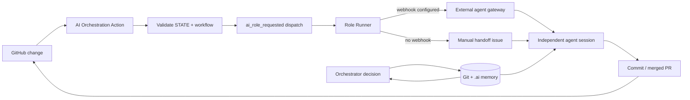

# MUSCAL – Multi-Agent Software Collaboration Layer

Wiederverwendbares GitHub-Template für KI-gestützte Softwareprojekte. Unabhängige Agenten und neue Sessions koordinieren sich über Git und `.ai/` – nicht über dauerhaftes Chat-Gedächtnis.

> **Prinzip:** Die KI entscheidet, **was** als Nächstes sinnvoll ist. GitHub Actions und die Protokoll-CLI entscheiden, **wie** ein geprüfter Handoff technisch ausgelöst wird.

## Was das Template mitbringt

- persistentes, validiertes `STATE.json` mit Revisionen und Iterationslimit;
- komprimierten Projektkontext in `CONTEXT.md`;
- Rollen für Orchestrator, Analyzer, Worker, Reviewer und Tester;
- automatische Workflow-Auswahl sowie dynamische Abläufe für Cleanup, Feature, Bugfix, Refactor und Security;
- strukturierte Decisions, Assignments und unveränderliche Results;
- Duplicate-/Stale-Work-Schutz durch Task-, Assignment- und Revisionsprüfungen;
- parallele Assignments für explizit getrennte Arbeitsbereiche;
- provider-neutrale GitHub-Dispatches und einen Webhook-Adapter;
- einen manuellen Issue-Fallback, falls noch kein Agent-Gateway konfiguriert ist;
- Loop-Guards, klare Terminalzustände und Human Escalation;
- Standardbibliothek-only Python-CLI und automatisierte Protokolltests.

## Architektur



Agenten starten keine weiteren Agenten. Eine Rollen-Session schreibt ein Result und gibt an den Orchestrator zurück. Der Orchestrator wählt anhand von Task, aktuellem Repository, Result-Historie und Workflow-Regeln den nächsten Zustand.

## Verzeichnisstruktur

```text
.ai/
├── AGENTS.md               # gemeinsames Agentenprotokoll
├── CONFIG.yml              # provider-neutrale Rollenbindung
├── STATE.json              # kanonischer aktueller Zustand
├── CONTEXT.md              # kurze, aktuelle Zusammenfassung
├── DECISION.json           # letzte Orchestrator-Entscheidung
├── TASKS/                  # dauerhafte Aufgabenbeschreibungen
├── ROLES/                  # unabhängige Rollenverträge
├── WORKFLOWS/              # erlaubte dynamische Zustände/Übergänge
├── SCHEMAS/                # JSON-Schemas für Maschinenintegration
└── HISTORY/<task-id>/      # Decisions und Agent-Results
.github/workflows/
├── ai-task-intake.yml      # neue Aufgabe anlegen
├── ai-orchestration.yml    # aktuellen Handoff auslösen
├── ai-role-runner.yml      # Webhook- oder Issue-Adapter
└── ai-protocol-checks.yml  # Validierung und Unit-Tests
scripts/ai/protocol.py      # transaktionale Protokoll-CLI
```

Die Dateien `*.yml` unter `.ai/` verwenden absichtlich JSON-Syntax. JSON ist gültiges YAML; dadurch kann ein frischer Checkout alle Regeln ohne zusätzliche Python-Pakete validieren.

## Schnellstart

### 1. Repository aus dem Template erstellen

In GitHub **Use this template** auswählen. Danach unter **Settings → Actions → General** Workflow-Berechtigungen mit Schreibzugriff erlauben, wenn „AI Task Intake“ direkt auf den Default Branch committen soll. Branch Protection muss diesen Bot-Commit erlauben; alternativ wird eine Aufgabe lokal angelegt und normal per PR gemergt.

Prüfen:

```bash
python3 scripts/ai/protocol.py validate
python3 -m unittest discover -s scripts/ai/tests -v
python3 scripts/ai/protocol.py status
```

### 2. Aufgabe anlegen

Lokal:

```bash
python3 scripts/ai/protocol.py start-task \
  --id feature-001 \
  --title 'Benutzer-Authentifizierung' \
  --workflow feature \
  --description 'Sichere Anmeldung mit klaren Akzeptanzkriterien implementieren.'
```

Danach `.ai/TASKS/feature-001.md` konkretisieren, validieren, committen und pushen. Mit `--workflow auto` wählt der erste Orchestrator-Decision den passenden konkreten Workflow; dies ist auch der Standard im GitHub-Intake. Alternativ in GitHub **Actions → AI Task Intake → Run workflow** verwenden. Der Intake persistiert Task, State und Context und dispatcht anschließend den Orchestrator.

### 3. Agent-Anbindung konfigurieren

Ohne Konfiguration erzeugt `ai-role-runner.yml` pro eindeutiger Request-ID ein manuelles Handoff-Issue. Damit ist das Protokoll sofort nachvollziehbar nutzbar, startet aber verständlicherweise noch kein externes LLM.

Für automatische Sessions folgende Repository-Secrets setzen:

- `AI_AGENT_WEBHOOK_URL` – HTTPS-Endpunkt eines eigenen Agent-Gateways;
- `AI_AGENT_WEBHOOK_TOKEN` – optionaler Bearer Token.

Das Gateway erhält einen provider-neutralen JSON-Payload, z. B.:

```json
{
  "protocol_version": "1.0",
  "request_id": "feature-001:feature-001:analyzer:architecture-1",
  "task_id": "feature-001",
  "workflow": "feature",
  "state": "ARCHITECTURE_REQUIRED",
  "state_revision": 2,
  "assignment_id": "feature-001:analyzer:architecture-1",
  "role": "analyzer",
  "scope": "Relevant architecture",
  "instructions": "Inspect current behavior and produce a bounded plan.",
  "acceptance_criteria": ["Findings cite files"],
  "repository": "owner/repository",
  "ref": "main",
  "sha": "...",
  "task_file": ".ai/TASKS/feature-001.md",
  "role_file": ".ai/ROLES/analyzer.md",
  "state_file": ".ai/STATE.json",
  "context_file": ".ai/CONTEXT.md"
}
```

Das Gateway kann OpenCode, Arena AI oder andere Modelle anhand von `role` und `.ai/CONFIG.yml` auswählen. Details: [Agent-Gateway integrieren](docs/agent-gateway.md).

## Session-Ablauf

Jede Session nimmt vollständigen Gedächtnisverlust an und liest in dieser Reihenfolge:

1. eigene Rollendefinition;
2. `.ai/AGENTS.md`;
3. `.ai/STATE.json` inklusive Revision;
4. aktive Task-Datei;
5. `.ai/CONTEXT.md`;
6. Git-Status, relevante Commits und Diffs;
7. nur die relevanten letzten History-Records;
8. bereits erledigte Arbeit im Vergleich zum Assignment.

Nicht-Orchestrator-Rollen schließen mit `complete-assignment` ab. Beispiel:

```bash
python3 scripts/ai/protocol.py complete-assignment \
  --assignment-id 'feature-001:worker:implementation-1' \
  --status succeeded \
  --summary 'Feature und Regressionstests implementiert.' \
  --started-revision 4 \
  --expected-revision 4 \
  --check 'pytest: 42 passed' \
  --artifact 'src/auth.py' \
  --step 'Authentication implemented'
```

Der Orchestrator schreibt eine schema-konforme `.ai/DECISION.json` und wendet sie an:

```bash
python3 scripts/ai/protocol.py apply-decision --file .ai/DECISION.json
```

Die CLI weist veraltete Revisionen, illegale Rollen/Übergänge, doppelte IDs, zu viele parallele Assignments und überschrittene Iterationslimits zurück.

## Dynamik statt starrer Agentenkette

Jeder Workflow definiert erlaubte Phasen und Übergänge, aber keine unveränderliche Sequenz. Der Orchestrator darf beispielsweise:

- eine bereits erledigte Analyse erkennen und direkt Tests anfordern;
- nach einem konkreten Review-Finding eine Improvement-Runde starten;
- disjunkte Read-only-Analysen parallel dispatchen;
- bei erfüllten Kriterien `COMPLETED` wählen;
- bei fehlender Freigabe `HUMAN_REVIEW_REQUIRED` wählen;
- bei fehlender Fähigkeit oder sicherem Fortschrittsstopp `BLOCKED` wählen.

Eine identische Phase darf nur in einer neuen Iteration wiederholt werden. Neue Iterationen benötigen neue Evidenz oder ein konkretes ungelöstes Problem. Details: [Protokoll und Zustandsmodell](docs/protocol.md).

## Wichtige Betriebsregeln

- Der Default Branch ist die kanonische Quelle. Agenten arbeiten vorzugsweise auf separaten Branches/PRs; der nächste Dispatch erfolgt nach Merge der State-Änderung.
- Assignment-IDs sind Idempotency Keys. Doppelte GitHub-Events dürfen keine doppelte Arbeit erzeugen.
- Parallele Agenten erhalten getrennte Scopes/Branches. Updates des gemeinsamen `STATE.json` werden serialisiert.
- `CONTEXT.md` wird komprimiert und ersetzt veraltete Aussagen. Die History wächst, ist aber nicht der primäre Prompt.
- Secrets gehören weder in `.ai/` noch in Git-Historie oder Issues.
- Ein erfolgreicher Review bedeutet „keine konkrete blockierende Abweichung“, nicht „endlos nach Perfektion suchen“.

## Anpassung an ein neues Projekt

1. Projektkommandos und Qualitätsanforderungen in der normalen Projektdokumentation ergänzen.
2. Task-spezifische Akzeptanzkriterien definieren.
3. Rollen-Provider in `.ai/CONFIG.yml` dokumentieren und im Gateway routen.
4. Workflow-Phasen nur erweitern, wenn Schema, CLI-Validierung und Tests mit angepasst werden.
5. `python3 scripts/ai/protocol.py validate` als Required Check aktivieren.

## Lizenz

MIT – siehe [LICENSE](LICENSE).
