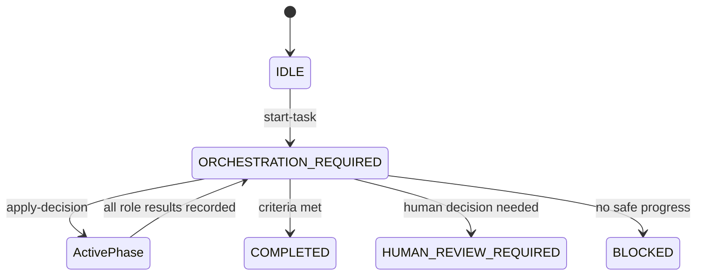

# Protocol and state model

## Sources of truth

| Source | Purpose | Update policy |
|---|---|---|
| Git tree and history | Code, detailed change record, merge state | Normal commits/PRs |
| `.ai/STATE.json` | Canonical current task and pending assignments | Only through protocol commands where supported |
| `.ai/CONTEXT.md` | Short reconstruction summary | CLI synchronizes the generated state block; agents maintain concise durable notes |
| `.ai/TASKS/` | Durable objective and acceptance criteria | Clarify deliberately; retain completed tasks |
| `.ai/HISTORY/` | Immutable decisions and role-result evidence | Generated by protocol commands |
| `.ai/DECISION.json` | Last orchestrator decision | Written by orchestrator, validated by CLI |

If prose and state disagree, stop and reconcile them. Do not silently choose whichever instruction is more convenient.

## State lifecycle

A new task starts at `ORCHESTRATION_REQUIRED` with one orchestrator assignment. Intake may name a concrete workflow or use `auto`; in auto mode the first orchestrator decision selects `cleanup`, `feature`, `bugfix`, `refactor`, or `security`. The orchestrator then applies a decision for one workflow phase. Examples include `ARCHITECTURE_REQUIRED`, `IMPLEMENTATION_REQUIRED`, `TEST_REQUIRED`, and `REVIEW_REQUIRED`; exact phase names are workflow-specific.



The current phase is preserved as `previous_state` during the return to orchestration. This allows the workflow definition to validate the next transition. `next_role` mirrors the first pending assignment for simple integrations; `active_assignments` is canonical and may contain several disjoint assignments.

## Optimistic concurrency

`revision` increments on every task start, applied decision, and recorded result. Orchestrator decisions include `based_on_revision`. Agents should pass `--expected-revision` when recording a result. A mismatch means another session moved shared state and the agent must re-bootstrap rather than overwrite it.

Parallel assignments keep stable assignment IDs when another parallel result advances the state revision. The dispatch verifier checks that the task and assignment are still pending, so an already-created request can still start safely. Integrations use `<task_id>:<assignment_id>` as the idempotent `request_id`.

Direct concurrent writes to `STATE.json` will conflict. Run parallel sessions on separate branches/worktrees and serialize result merges. Prefer parallel read-only investigations or explicitly disjoint production scopes.

## Iterations and duplicate prevention

`iteration` begins at zero. The first active decision sets it to one. A normal progression through different phases can remain in the same iteration. Repeating the same phase requires exactly one increment. A decision can never advance by more than one or exceed `max_iterations`.

The numeric guard is not sufficient by itself. The orchestrator must compare:

- active and completed assignment IDs;
- completed-step labels;
- recent commits and current diff;
- latest relevant role results;
- whether a proposed output is already present;
- whether new evidence or an unresolved concrete finding exists.

When the cap is reached, the current pipeline may finish, but no further improvement iteration should be started. Complete or escalate.

## Machine-readable commands

```text
validate                 Validate required files, workflows, and state invariants
status [--json]          Inspect current canonical state
start-task               Create task, context, and initial orchestrator assignment
apply-decision           Validate an orchestrator transition and persist its history
complete-assignment      Persist a role result and return to orchestration when ready
render-dispatches        Create provider-neutral repository_dispatch event bodies
verify-request           Reject a stale or forged role request
request-markdown         Render the manual handoff issue body
```

All commands use Python's standard library. They write JSON through same-directory temporary files followed by atomic replacement. A command validates the resulting state before replacing `STATE.json`.

## Terminal semantics

- `COMPLETED`: task and workflow criteria are met; evidence is adequate; no concrete blocking review finding or useful required assignment remains.
- `HUMAN_REVIEW_REQUIRED`: a named approval, product decision, conflict resolution, or unavailable human input is necessary.
- `BLOCKED`: current information/capability cannot produce safe progress. The reason and requested action must be explicit.

Terminal states have no active assignments. A new task may start after any terminal state and keeps the globally increasing revision.
